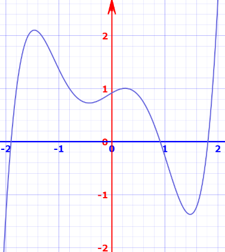

# ESA 2: Regression mit FFNN

- **Thema:**
    - Regression Lernen mit Feed-Forward Neural Network (FFNN) als Model
    - und mit TensorFlow.js (TFJS) als Framework/API

- **Bearbeitungszeit:** 20–25 Std, je nach Vorkenntnissen und Erfahrung.
- **Voraussetzungen:** Kapitel 1–13
- **Kompetenzerwerb/Lernziele:** Nach der Bearbeitung der Aufgabe sollten Sie:
    - Verstehen, wie ein neuronales Netz eine Funktion approximiert
    - Ein neuronales Netz anhand von Daten trainieren können
    - Das Phänomen des Overfittings verstehen und behandeln können
- **Vorbereitung:**
    - Verschaffen Sie sich einen Überblick über das [TensorFlow.js](https://www.tensorflow.org/js) Framework
    - Vollziehen Sie das
      ["Making predictions from 2d data" Tutorial](https://www.tensorflow.org/js/tutorials/training/linear_regression) nach

## Aufgabenstellung
Nutzen Sie ein FFNN als Modell zur Regression der reellwertigen Funktion:
- y(x) = 0.5*(x+0.8)*(x+1.8)*(x-0.2)*(x-0.3)*(x-1.9)+1 auf dem Intervall [-2, +2] (Definitionsmenge)
  Wir wollen simulieren, wie es im richtigen Leben ist, das bedeutet, Sie kennen die Funktion y(x) nicht (das ist die
  unbekannte Ground-Truth). Stattdessen generieren Sie Daten von dieser Funktion und verrauschen diese.

1) Zum Erzeugen der Daten generieren Sie N=100 zufällige, gleichverteilte x-Werte aus dem Intervall [-2,+2] (die
   Verteilung ist dabei flach, es gibt keine Anhäufung von x-Werten z. B. um null). Zu den x-Werten berechnen Sie y(x).
   Sie haben dann einen unverrauschten Datensatz mit 100 (x, y) = (Input, Output-Lable) Paaren. Diesen Datensatz teilen Sie
   auf in N/2 = 50 Trainingsdaten-Paare und N/2 = 50 Testdaten-Paare (die Aufteilung ist zufällig). Dann verrauschen Sie
   die Daten künstlich (Trainingsdaten und Testdaten). Dazu addieren Sie zu y (also zum Output / Label) normalverteiltes
   Rauschen (Gaussian Noise) mit einer Varianz von V = 0.05 (die x-Werte/Input bleiben dabei unverrauscht, wir simulieren
   nur sogenanntes Label-Rauschen). Sie haben nun 2 Datensätze, einen ohne und einen mit Rauschen, jeweils aufgeteilt in
   Trainingsdaten und Testdaten.

2) Den unverrauschten Datensatz benutzen Sie, um ein erstes Model zu trainieren. Da es kein Rauschen gibt (alle Daten
   liegen schön auf der Ground-Truth Funktion), sollte Ihr trainiertes Modell auf den Testdaten etwa genauso gut
   abschneiden wie auf den Trainingsdaten (Loss_train = Loss_test). Denn ohne Rauschen kann kein Overfitting auftreten
   (überlegen Sie, warum nicht).

Trainieren Sie 2 Modelle auf dem verrauschten Datensatz mit unterschiedlicher Anzahl an Trainings-Epochen (Epochs).

3) Das erste Modell (Best-Fit) soll möglichst gut generalisieren, also im Test einen möglichst kleinen Loss (MSE)
   aufweisen.

4) Versuchen Sie, das zweite Model (Over-Fit) so lange zu trainieren, bis es overfitted, bis also der Trainings-Loss
   (MSE) deutlich besser (geringer) ist als der auf den Testdaten.

## Modell und Optimierung
Nutzen Sie für Ihr Modell die folgende Netzwerkarchitektur und Parametern für die Neuronen und den Lernalgorithmus:
- Anzahl der hidden Layer und Neuron pro Layer: 2 hidden Layer mit je 100 Neuronen (Sie können auch mit anderen/größeren
  Architekturen experimentieren)
- Aktivierungsfunktionen in den hidden Layer: ReLU (Sie können auch mit anderen experimentieren)
- Aktivierungsfunktionen im Output Layer (1 Neuron): linear (y=x) "none"
- Als Loss nutzen Sie Mean-Squared-Error (MSE)
- Lernrate und Optimizer: Adam mit Lernrate(Learning Rate)=0.01 und Batch-Size=32 (Sie können auch mit anderen
  experimentieren)
- Anzahl der Trainings-Epochen (Epochs): Ausprobieren, dazu den Loss beobachten (Sie können dazu den Tensorflow (TF)
  Visor nutzen)
- Datenpunkte: N=100 (50 Train + 50 Test) (Sie können auch hier experimentieren, und schauen was passiert, wenn Sie nur
  sehr wenig Daten haben)
- Rauschen: Gaussian Noise mit einer Varianz V=0.05

## Experimente + Fragestellungen
Was ist das beste Ergebnis (Loss/MSE), das Sie auf den beiden Datensätzen (mit und ohne Rauschen) erzielen können?
Unterscheiden Sie dabei sorgfältig zwischen Trainings- und Test-Loss. Stellen Sie die Anzahl der Trainings Epochs so
ein, dass Sie das Phänomen Overfitting beobachten oder auch vermeiden können.

Seien Sie sich bewusst darüber, dass man die Testdaten in keiner Weise zum Training oder zur Optimierung nutzen darf,
sonst sind es keine unabhängigen Testdaten mehr. Man darf sie also auch nicht zum early Stopping, d. h. zur optimalen Einstellung der Trainings-Epochs benutzen. Dazu verwendet man normalerweise einen dritten, so genannten Validierungs-Datensatz (Validationset). Wir verzichten bei dieser Aufgabe zu Gunsten der Übersichtlichkeit auf einen solchen Validationset.

## Resultate, Visualisierung, Layout
Visualisieren Sie die Daten, den Loss und die Vorhersagen innerhalb von Diagrammen/Plots (siehe Libraries).
Stellen Sie auf einer HTML-Seite alle Resultate in 2 Spalten übereinander in der folgenden Reihenfolge dar:

1) Die Datensätze: links ohne Rauschen, rechts mit Rauschen, Trainingsdaten und Testdaten farblich unterschieden jeweils
   zusammen in einem Diagramm

2) Die Vorhersage des Modells, das ohne Rauschen trainiert wurde y_unverrauscht(x), links auf den Trainingsdaten, rechts
   auf den Testdaten (beide ohne Rauschen)

3) Die Vorhersage Ihres besten Modells y_best(x) trainiert auf den verrauschten Daten, links auf den Trainingsdaten,
   rechts auf den Testdaten (alles mit Rauschen)

4) Die Vorhersage Ihres Overfit-Modells y_overfit(x) trainiert auf den verrauschten Daten, links auf den Trainingsdaten,
   rechts auf den Testdaten (alles mit Rauschen)

Schreiben Sie unter die Diagramme mit den Vorhersagen, den Loss=MeanSquaredError(MSE) jeweils für die Trainings- und
Testdaten. Achten Sie darauf, dass die Werte für den Loss zu den dargestellten Daten passen.

## Diskussion
Dokumentieren und begründen Sie Ihre Parameter und Einstellungen. Diskutieren Sie Ihre Ergebnisse (unter den Resultaten
auf der gleichen HTML-Seite, max. 10 Sätze). Was haben Sie beobachtet / gelernt?

## Dokumentation
Nutzen Sie die gleiche HTML-Seite (unter der Diskussion) wie zur Abgabe Ihrer Lösung zur Dokumentation der folgenden
Aspekte:

1) Technisch: Listen Sie alle verwendeten Frameworks auf und erklären Sie kurz (1–3 Sätze), wozu Sie diese verwenden.
   Dokumentieren Sie die technischen Besonderheiten Ihrer Lösung

2) Fachlich: Erläutern Sie Ihre Implementierung der Logik und alles, was für ihre Lösung wichtig ist (Ansatz, Resultate,
   Quellen, etc.)

Schreiben Sie bitte nichts in die Moodle Abgabe-Felder.

## Interaktion
Ihre Abgabe wird ohne Interaktion beurteilt, d. h. die HTML-Seite wird so belassen, wie diese initial dargestellt wird.
Die HTML-Seite soll aber nicht statisch sein (nicht nur Bilder), sondern dynamisch aufgebaut werden, d. h. Ihre
Datensätze werden initial geladen oder erzeugt und von Ihren vor-trainierten Modellen verarbeitet und die Resultate in
Diagrammen dargestellt.

Für Ihren eigenen Entwicklungszyklus sollte es in Ihrer Applikation möglich sein:
- Einen Datensatz zu erzeugen, zu speichern und zu laden.
- Parameter für ein Modell einzustellen und dieses zu trainieren.
- Ein trainiertes Modell zu speichern und zu laden.
- Ein Modell zu testen.

## Abgabe
Sie stellen Ihre Lösung als Web-Anwendung (HTML Web-Seite) auf einem öffentlichen Web-Server bereit, siehe Kursplan.

**Hinweise**  
Schauen Sie sich die Funktion, die gelernt werden soll, als Graph an, z. B. bei
https://www.mathsisfun.com/data/function-grapher.php

Sie sollten nicht wie in dem Tutorial den Output Wertebereich normalisieren. Denn wenn Sie die Daten normalisieren,
müssen Sie das immer machen: beim Training und auch bei der Prediction. Wenn die Daten nicht normalisiert sind, muss die
Range der Output-Activation-Function zur gewünschen Output-Wertemenge passen (diese darf also z. B. nicht auf [0,1]
beschränkt sein).

Zum Verrauschen können Sie eine Bibliothek wie TF verwenden oder selber eine Funktion schreiben (siehe dazu)

Oder auch (mit Bezug zum Zentralen Grenzwertsatz):
https://riptutorial.com/javascript/example/8330/random--with-gaussian-distribution
https://de.wikipedia.org/wiki/Zentraler_Grenzwertsatz

**Fehlerbehandlung, Test und QA**
Prüfen Sie alle Daten auf korrektes Format. Testen Sie Ihre Modelle auf mehreren zufällig erzeugten Testdaten

**Gestaltung**
Achten Sie auf eine sinnvolle Semantik bei der Farbgestaltung und ein übersichtliches Layout. (Siehe dazu:
material.io - Design Guidance and Code)

**Libraries**
Sie können dazu, außer der API von TF (Visor), z. B. folgende Bibliotheken nutzen: Plotly, D3, Chart.js, etc.

**Coding:** Siehe Vorbereitung und https://js.tensorflow.org/api/latest/

**Arbeitsumgebung:** JS-, HTML-IDE (z. B. Atom, WebStorm, Visual Studio Code), [local] Web-Server.

**Testumgebung:** Chrome [unter macOS].

## Bewertungskriterien + Punkte
Beachten Sie die Human/Mensch-Computer-Interaction (HCI) Kriterien beim Interaktionsdesign: ISO 9241-11 Anforderungen an die Gebrauchstauglichkeit und ISO 9241-110 Interaktionsprinzipien. Ihre Anwendung sollte funktional (Aufgabenangemessenheit) und benutzerfreundlich (Usability) und mit angemessenem Feedback und einer [kontextsensitive] Hilfe ausgestattet sein.
1. Korrekte Erzeugung der Daten (für Training und Test, mit und ohne Rauschen) (5)
2. Funktionsfähigkeit + Vollständigkeit der Lösung entsprechend Aufgabenstellung (5)
3. Experimente, Resultate und Diskussion (10)
4. Dokumentation, technisch und fachlich (5)
5. Gestaltung und Visualisierung (Farben, Formen, Screen-Layout, Text, Semantik) (5)

**Gesamtpunktzahl:** 30 Punkte
